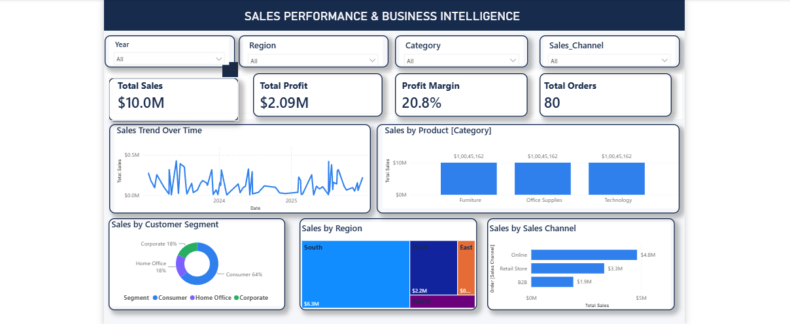
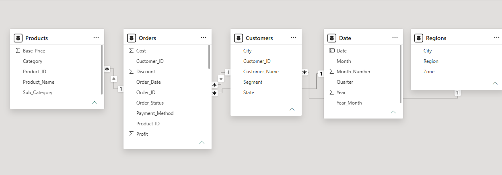

# Sales Performance & Business Intelligence

## Project Overview

An end-to-end **Sales Performance and Business Intelligence** project built using **Microsoft Power BI, Power Query, DAX, and data modeling**.

The project transforms raw sales transaction data into an interactive dashboard to analyze sales performance, profitability, customer segments, products, regions, sales channels, and business trends.

## Dashboard Preview

## Data Model

The Power BI data model follows a **star-schema approach**, with the Orders table as the main fact table and Customers, Products, Regions, and Date as supporting dimension tables.

## Business Objectives

- Monitor overall sales and profitability
- Analyze sales trends over time
- Identify high-performing product categories
- Compare regional sales performance
- Analyze customer segment contribution
- Compare sales channels
- Track key business KPIs

## Dataset

The project uses an Excel-based sales dataset containing:

- **Orders** — transaction-level sales data
- **Customers** — customer information and segments
- **Products** — product and category details
- **Regions** — regional information
- **Date** — calendar and time-intelligence data

## Tools & Technologies

- Microsoft Power BI
- Power Query
- DAX
- Data Modeling
- Microsoft Excel
- Data Analysis
- Business Intelligence
- Data Visualization

## Project Workflow

**Raw Data → Power Query → Data Cleaning & Transformation → Data Modeling → DAX → KPI Development → Dashboard → Business Insights**

### Power Query

Performed data cleaning and transformation including:

- Data type validation
- Handling missing values
- Duplicate validation
- Data preparation for modeling

### Data Modeling

Built a relational **star-schema data model** using:

- Fact table: Orders
- Dimension tables: Customers, Products, Regions, Date
- One-to-many relationships
- Date table for time-intelligence analysis

### DAX & KPIs

Created measures for:

- Total Sales
- Total Profit
- Profit Margin
- Total Orders
- Total Customers
- Average Order Value
- Sales YTD
- Profit YTD
- Sales Growth
- Profit Growth
- Return & Cancellation Rate

## Dashboard Features

The interactive Power BI dashboard includes:

- KPI cards
- Sales trend analysis
- Sales by product category
- Sales by region
- Sales by customer segment
- Sales by sales channel
- Year, Region, Category, and Sales Channel filters

## Key Business Insights

The dashboard enables analysis of:

- Sales and profitability trends
- Product category performance
- Regional sales contribution
- Customer segment performance
- Sales channel performance
- Year-over-year business growth

## Project Files

| File | Description |
|---|---|
| `Dashboard.png` | Power BI dashboard screenshot |
| `Model_view.png` | Power BI data model screenshot |
| `Sales_Performance_BI_Dataset.xlsx` | Project dataset |
| `business_analytics.pbix` | Power BI project file |
| `README.md` | Project documentation |

## Project Purpose

This project demonstrates practical skills in **data cleaning, Power Query, data modeling, DAX, KPI development, data visualization, and Business Intelligence dashboard development** using Power BI.